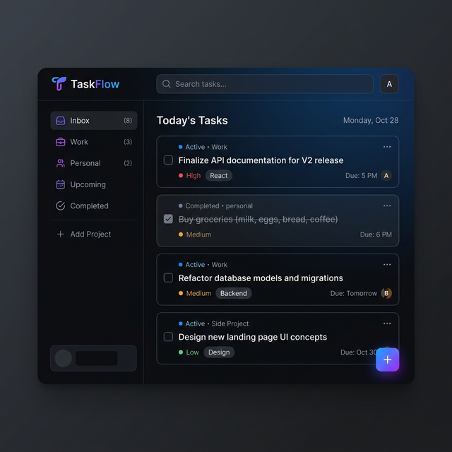

# 🚀 Modern Todo Application

A professional, high-performance Todo Application built with **React**, **Redux Toolkit**, and **TypeScript**. This project serves as a demonstration of state-of-the-art frontend development practices, including type safety, robust state management, and responsive UI design.



## 🔗 Live Demo
Check out the live application here: [https://yashwantharcot.github.io/todo-app/](https://yashwantharcot.github.io/todo-app/)

---

## ✨ Features

- **🔐 User Authentication**: Simple and secure login simulation to protect your tasks.
- **📝 Task Management**: Add, delete, and organize tasks with a clean, intuitive interface.
- **⚡ Real-time Updates**: Instant UI feedback powered by Redux state management.
- **📱 Responsive Design**: Fully optimized for mobile, tablet, and desktop screens.
- **🛡️ Type Safety**: Built from the ground up with TypeScript for maximum reliability.

---

## 🛠️ Tech Stack


---

## 🚦 Getting Started

### Prerequisites
- **Node.js**: v14 or higher
- **npm**: v6 or higher

### Installation

1. **Clone the repository**
   ```bash
   git clone https://github.com/yashwantharcot/todo-application.git
   ```

2. **Navigate to the directory**
   ```bash
   cd todo-application
   ```

3. **Install dependencies**
   ```bash
   npm install
   ```

4. **Start the development server**
   ```bash
   npm start
   ```

The application will be available at `http://localhost:3000`.

---

## 🏗️ Architecture

- **State Management**: Redux Toolkit for predictable state transitions and efficient data flow.
- **Component Pattern**: Modular, reusable functional components built with React Hooks.
- **Type Definitions**: Comprehensive interfaces and types for enhanced developer experience and catchable errors.

---

## 📄 License

This project is licensed under the MIT License - see the [LICENSE](LICENSE) file for details.

---

Built with ❤️ by [Arcot Yashwanth](https://github.com/yashwantharcot)
